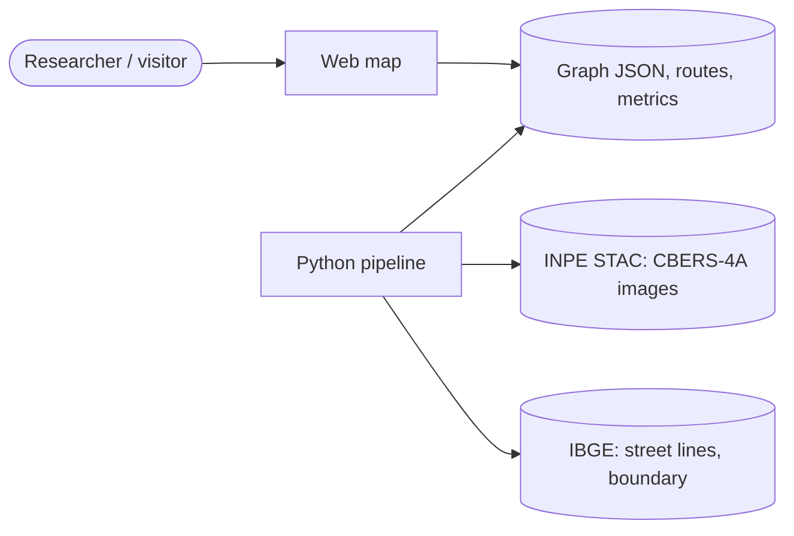
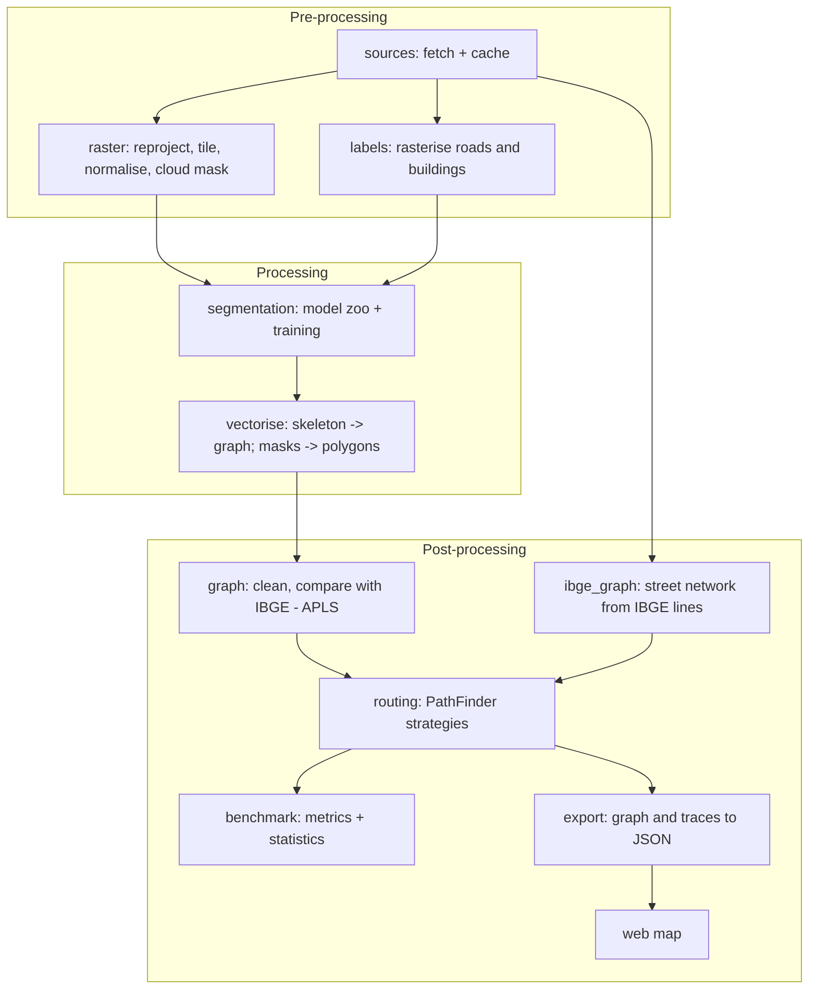

# Architecture (draft)

**Author:** Tiago Rodrigues (UTFPR) · **Version:** 0.1, 2026-10-04 · Structure follows a reduced arc42 template
(Starke & Hruschka) with C4-style views (Brown).

## 1. Goals and quality attributes

| Quality (ISO/IEC 25010) | Concrete requirement |
|---|---|
| Functional correctness | Exact algorithms return the true shortest path (checked against NetworkX on every test graph). |
| Reproducibility | Every stage is a command with a config file; seeds fixed; data versions recorded. |
| Modifiability | A new path-finding algorithm or segmentation model is added without editing existing ones (Open/Closed). |
| Testability | Each stage is a pure function of its inputs where possible; small synthetic graphs and rasters in tests. |
| Performance | Routing benchmark on the Londrina graph (~10^4-10^5 edges) runs on a laptop CPU; segmentation trains on a 6 GB GPU. |
| Usability | The web map works on a phone and shows every algorithm's exploration step by step. |

## 2. Context (C4 level 1)



The pipeline runs offline and publishes static artefacts; the web map is a static site (GitHub Pages) that runs
the algorithms in the browser on the published graph. No server, no user data stored.

## 3. Building blocks (C4 level 2-3)

Pipes-and-filters for the data flow (Buschmann et al., *POSA vol. 1*); each filter is a module with one
responsibility.



| Package | Responsibility | Key abstraction |
|---|---|---|
| `sources` | Download and cache CBERS-4A scenes (INPE STAC) and IBGE vectors; record version and licence | `DataSource` interface (one class per source) |
| `raster` | Reprojection to EPSG:31982, tiling, normalisation, cloud masking | pure functions over `rasterio` datasets |
| `labels` | Rasterise vector roads/buildings into masks aligned with the tiles | pure functions |
| `segmentation` | Models, training loop, inference; model choice by config | `SegmentationModel` (registry, Factory) |
| `vectorise` | Road mask -> skeleton -> graph; building mask -> polygons | pure functions |
| `graph` | Build the IBGE graph (noding street lines), clean and simplify, APLS against a reference graph | `RoadGraph` wrapper over NetworkX |
| `routing` | Path-finding algorithms with a common interface and exploration traces | `PathFinder` (Strategy) |
| `benchmark` | Origin-destination sampling, metrics, paired statistical tests | `Experiment` |
| `export` | Graph, routes and traces to compact JSON for the web | pure functions |
| `web/` | TypeScript + MapLibre map, origin/destination input, animation player | `AlgorithmPlayer` |

### Routing design

```text
PathFinder (interface)
  find(graph, source, target, weight) -> RouteResult(path, cost, expanded_nodes, runtime_s, trace)

Exact:         Dijkstra · A* (haversine heuristic) · bidirectional Dijkstra · ALT · contraction hierarchies
Heuristic:     greedy best-first · beam search
Metaheuristic: ant colony optimisation · genetic algorithm (variable-length path chromosomes)
               · simulated annealing · particle swarm (path encodings)
Multi-objective: NSGA-II over (distance, travel time, number of turns)
```

Each algorithm is one class implementing `PathFinder` (Strategy pattern, GoF), registered by name so the benchmark
and the web map discover it without edits (Open/Closed, Dependency Inversion). Every algorithm emits the same
`trace` (nodes visited per step), which the web player animates identically for all algorithms. The exact
algorithms are the reference: metaheuristics are scored by optimality gap, success rate, runtime and expanded
nodes over many origin-destination pairs, with paired tests across seeds.

## 4. Runtime view: one benchmark run

1. `graph.ibge_graph` builds the street network of Londrina from the IBGE block faces: faces buffered by 8 m and
   rasterised at 2 m form the street corridors, the corridors are thinned to centre lines (`skimage` skeleton,
   Zhang and Suen 1984) and `graph.skeleton` turns the skeleton into a graph; short spurs are pruned, degree-2
   nodes merged, each edge named after the nearest face, and the largest component kept (edge lengths in metres;
   the IBGE data have no speeds or one-way streets, so routes minimise distance).
2. `benchmark` samples N origin-destination pairs (stratified by straight-line distance) with a fixed seed.
3. For each pair and each `PathFinder`: run, record metrics and the trace; metaheuristics run several seeds.
4. Results go to a tidy table; statistics (Friedman + Nemenyi or Wilcoxon-Holm) and plots are produced.
5. `export` writes the graph, a sample of traces and the summary for the web map.

## 5. Decisions (ADR summary)

| # | Decision | Reason |
|---|---|---|
| 1 | Start with the IBGE street graph (milestone 1) before images | Delivers the routing study and demo early; gives the reference graph for APLS later |
| 2 | CBERS-4A 2 m as the image source | Free (CC BY 4.0), Brazilian, fine enough for urban streets; Sentinel-2 at 10 m is too coarse |
| 3 | Brazilian public data only (INPE images, IBGE vectors); buildings from a hand-annotated sample | One citable dataset family for the article; no OpenStreetMap or commercial sources (author's decision, 2026-10-04) |
| 4 | Algorithms run in the browser on a static graph | No server to maintain; same code path for every algorithm's animation |
| 5 | SIRGAS 2000 / UTM in the zone of each city (`utm_crs`: EPSG 31960 + zone; 22S for Londrina, Curitiba and Florianópolis, 23S for São Paulo, ABC and Brasília) for all metric work (revised 2026-10-09; first version fixed 22S) | Official Brazilian datum; metres for lengths and APLS; a fixed 22S distorts cities in zone 23 |
| 6 | IBGE graph from a rasterised street corridor and its skeleton, not by noding the face lines (2026-10-05) | IBGE publishes block faces (two parallel lines per street, cut at the corners), not centre lines, so noding gives two disconnected networks; the raster skeleton recovers one centre line and reuses the code that vectorises the CBERS-4A road masks in milestone 3, so APLS compares images, not vectorisers |
| 7 | Web page in the author's portfolio (Angular), MapLibre GL CSP build, every layer a static GeoJSON of the site | No tile or API server, the site's strict Content-Security-Policy stays unchanged, and the page works without third-party services |
| 8 | Estimated links where the road distance between junctions under 100 m apart is over 10x their gap, only if the link crosses no block face and no street (2026-10-05) | The inner sides of an avenue's carriageways face no block, so the openings of wide central medians are missing: 13.9% of Londrina's node pairs 150-600 m apart needed a detour over 5x (worst 261x). With them (143 estimated links in all, 7.75 km, 0.4% of the network) it is 3.8% (worst 38x); the guards keep links out of blocks and off real road crossings. Links are dashed on the map |
| 9 | Corridor rasterised in 8 km tiles with a 400 m overlap; only each tile's core is kept, and the skeleton is stored as sorted pixel keys (`skeleton.sparse_skeleton_to_graph`) (2026-10-09) | São Paulo at 2 m is ~7.5 x 10^8 pixels, beyond 16 GB of RAM as images and label arrays. Closing, hole filling and thinning are local, so a 400 m margin makes each core exact: tests check tiled = whole skeleton, and the sparse graph = the image-based graph on 61 random skeletons; Londrina rebuilt tiled gives the identical graph (10,640 nodes, 16,526 edges, 2,002.8 km) in 30 s instead of 80 s |
| 10 | Routed areas of one or more municipalities (`export/areas.py`); the ABC Paulista (7 municipalities) is one graph (2026-10-09) | Streets continue across municipal borders, so joining the faces before drawing the corridor connects them with no invented link |
| 11 | Keep every connected part with at least 20 km of streets instead of only the largest (2026-10-09) | Roads without facing blocks (bridges, highways between Brasília's administrative regions) split cities: keeping only the largest part left 24% of Brasília's network (Taguatinga/Ceilândia, not the Plano Piloto) and 53% of Florianópolis'. With the rule: Brasília 75 parts, 9,265 km; Florianópolis 5 parts, 1,535 km. Routes between parts do not exist in these data and the web page says so |
| 12 | `bridge_detours` pre-filters pairs with one bounded Dijkstra per source node | Links only shorten distances, so a pair short enough before any link stays so; equivalent result, needed for ~10^6 pairs in São Paulo |

## 6. Risks

- CBERS-4A cloud cover and 2 m resolution may merge narrow streets and tree-covered roads; mitigated by multi-date
  composites and by reporting APLS by road class.
- IBGE street lines are misaligned with the imagery by a few metres and cover urban areas only; mitigated by
  buffered road labels, a boundary-tolerant loss, and an urban-only area of interest.
- No building vectors in the chosen sources: the building class depends on a hand-annotated sample, kept small and
  stratified by neighbourhood type.
- Metaheuristics on graphs with 10^4+ nodes may be slow or fail to find a path; their random walks are
  self-avoiding with backtracking (the ants' memory of ACO, Dorigo & Stutzle 2004), a randomised depth-first search
  that always reaches the target of a connected graph, and they start from goal-biased walks.
- Estimated links (ADR 8) may join two sides of a real barrier narrower than 100 m with no block faces (a narrow
  valley park); they are drawn dashed and counted, and routes that use them can be told apart.

## 7. Engineering practice

Code follows SOLID (Martin), keeps clear of the smells catalogued by Fowler, and is reviewed twice before each
commit (author pass, then a review pass with tests and linters: ruff, mypy, pytest; ESLint and Vitest for the
web). ML-specific practice follows Sculley et al. (2015) and Breck et al. (2017): data and model versions
recorded, tests for data, model and infrastructure.

## References

**Software engineering**
- Bass, L.; Clements, P.; Kazman, R. *Software Architecture in Practice*. 4th ed. Addison-Wesley, 2021.
- Buschmann, F. et al. *Pattern-Oriented Software Architecture, Vol. 1: A System of Patterns*. Wiley, 1996.
- Gamma, E.; Helm, R.; Johnson, R.; Vlissides, J. *Design Patterns*. Addison-Wesley, 1994.
- Martin, R. C. *Clean Architecture*. Prentice Hall, 2017. · *Clean Code*. Prentice Hall, 2008.
- Fowler, M. *Refactoring*. 2nd ed. Addison-Wesley, 2018.
- McConnell, S. *Code Complete*. 2nd ed. Microsoft Press, 2004.
- Starke, G.; Hruschka, P. *arc42* template, arc42.org. · Brown, S. *The C4 model for visualising software architecture*, c4model.com.
- ISO/IEC 25010:2023. *Systems and software Quality Requirements and Evaluation (SQuaRE): Product quality model*.
- Sculley, D. et al. Hidden technical debt in machine learning systems. *NeurIPS*, 2015.
- Breck, E. et al. The ML Test Score: a rubric for ML production readiness. *IEEE Big Data*, 2017.

**Path finding and optimisation**
- Dijkstra, E. W. A note on two problems in connexion with graphs. *Numerische Mathematik* 1, 1959.
- Hart, P. E.; Nilsson, N. J.; Raphael, B. A formal basis for the heuristic determination of minimum cost paths.
  *IEEE Trans. Systems Science and Cybernetics* 4(2), 1968.
- Goldberg, A. V.; Harrelson, C. Computing the shortest path: A* search meets graph theory. *SODA*, 2005.
- Geisberger, R. et al. Contraction hierarchies: faster and simpler hierarchical routing in road networks. *WEA*, 2008.
- Dorigo, M.; Maniezzo, V.; Colorni, A. Ant system: optimization by a colony of cooperating agents.
  *IEEE Trans. Systems, Man, and Cybernetics B* 26(1), 1996.
- Deb, K. et al. A fast and elitist multiobjective genetic algorithm: NSGA-II. *IEEE Trans. Evolutionary Computation* 6(2), 2002.

**Data**
- IBGE. *Base de Faces de Logradouros do Brasil*, Censo Demográfico 2022. Rio de Janeiro: IBGE, 2024.
- INPE. CBERS-4A WPM products (STAC catalogue, data.inpe.br), CC BY 4.0.

**Road and building extraction**
- Ronneberger, O.; Fischer, P.; Brox, T. U-Net. *MICCAI*, 2015.
- Chen, L.-C. et al. Encoder-decoder with atrous separable convolution (DeepLabv3+). *ECCV*, 2018.
- Xie, E. et al. SegFormer. *NeurIPS*, 2021.
- Van Etten, A.; Lindenbaum, D.; Bacastow, T. SpaceNet: a remote sensing dataset and challenge series. arXiv:1807.01232, 2018 (APLS metric).
- Demir, I. et al. DeepGlobe 2018: a challenge to parse the Earth through satellite images. *CVPR Workshops*, 2018.
- Máttyus, G.; Luo, W.; Urtasun, R. DeepRoadMapper. *ICCV*, 2017.
- Batra, A. et al. Improved road connectivity by joint learning of orientation and segmentation. *CVPR*, 2019.
