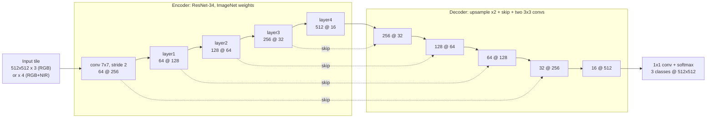

# Neural network: street and building segmentation

**Author:** Tiago Rodrigues (UTFPR) · **Version:** 0.1, 2026-10-04 · Hyperparameters live in
[`configs/segmentation.yaml`](../configs/segmentation.yaml); this page explains each one and what changing it does.

## Task

Per-pixel classification of a CBERS-4A tile into **background**, **road** and **building**. The road mask then
becomes a graph (`vectorise`), the building mask becomes polygons.

## Default model: U-Net with a ResNet-34 encoder

U-Net (Ronneberger et al., 2015): an encoder that shrinks the image while learning features, a decoder that grows
it back, and skip connections that copy fine detail across, which matters for 2-4 pixel-wide streets. The encoder
is a ResNet-34 (He et al., 2016) pre-trained on ImageNet. About 24 million parameters; a 512 x 512 tile covers
1 km x 1 km at 2 m per pixel.

`C @ S` = channels at S x S pixels. Alternatives selectable in the config (same input and output):

| Architecture | Idea | Reference |
|---|---|---|
| `unet` (default) | encoder-decoder with skip connections | Ronneberger et al., MICCAI 2015 |
| `deeplabv3plus` | atrous (dilated) convolutions for wide context + light decoder | Chen et al., ECCV 2018 |
| `segformer` | Transformer encoder (Mix Transformer), all-MLP decoder | Xie et al., NeurIPS 2021 |

## Hyperparameters you can change

Run a single change and compare with the default: the training report shows IoU per class, APLS of the
extracted graph and example tiles side by side. A search over several at once uses Optuna (`hpo` block), with a
Bayesian (TPE) or an evolutionary (CMA-ES) sampler, which is itself a comparison for the paper.

| Group | Hyperparameter | Default | Range to try | What changing it does |
|---|---|---|---|---|
| Data | `bands` | `rgb` | `rgb`, `rgb_nir` | NIR (8 m, upsampled) separates vegetation from asphalt; may help tree-lined streets, blurs edges |
| | `tile_size` | 512 | 256-1024 | larger tiles give more context per street but fewer tiles per batch on 6 GB |
| | `road_buffer_m` | 4 | 2-8 | width of the road label drawn around each IBGE line: too thin misses the asphalt, too wide eats sidewalks |
| Model | `architecture` | `unet` | see table above | U-Net keeps thin details; DeepLabv3+ sees wider context; SegFormer is stronger but heavier |
| | `encoder` | `resnet34` | `resnet18`, `resnet50`, `efficientnet-b0`, `mit_b0`, `mit_b2` | bigger encoders learn more, train slower, risk over-fitting a single city |
| | `pretrained` | `imagenet` | `imagenet`, `none` | pre-training speeds up learning with few labelled tiles |
| Training | `epochs` | 40 | 20-100 | more epochs until validation IoU stops rising (early stopping guards it) |
| | `batch_size` | 8 | 2-16 | bounded by GPU memory; smaller batches are noisier |
| | `learning_rate` | 3e-4 | 1e-5-1e-3 | too high diverges, too low stalls; the most sensitive setting |
| | `weight_decay` | 1e-4 | 0-1e-2 | regularisation against over-fitting |
| | `scheduler` | `cosine` | `cosine`, `onecycle`, `plateau` | how the learning rate decays |
| Loss | `ce_weight`, `dice_weight` | 1.0, 1.0 | 0-1 | cross-entropy fits pixels; Dice copes with roads being a small share of pixels |
| | `cldice_weight` | 0.0 | 0-1 | clDice (Shit et al., CVPR 2021) rewards connected roads: fewer broken streets in the graph |
| | `class_weights` | 1, 3, 2 | 1-10 | more weight on road/building fights class imbalance; too much adds false positives |
| Augmentation | `flips_rot90`, `color_jitter`, `scale_jitter` | on, 0.2, 0.1 | on/off, 0-0.4, 0-0.3 | robustness to orientation, season and haze; too much hides real texture |
| Inference | `road_threshold` | 0.5 | 0.3-0.7 | lower keeps more road pixels (better connectivity, more noise) |
| | `test_time_augmentation` | off | on/off | averages flipped predictions: smoother masks, 4-8x slower |
| Vectorise | `min_branch_m` | 20 | 5-50 | removes short skeleton spurs; too high deletes cul-de-sacs |
| | `junction_merge_m` | 6 | 2-15 | merges nearby junctions into one intersection |
| | `simplify_tolerance_m` | 2 | 0.5-5 | Douglas-Peucker simplification of street geometry |
| Reproducibility | `seeds` | 1, 2, 3 | any | report mean and spread over seeds, not one run |

## How outcomes are shown

- **Training report** per run: loss curves, IoU per class, confusion matrix, APLS of the extracted graph, and a grid
  of tiles (image, label, prediction, errors).
- **Comparison table** across runs (one row per hyperparameter setting, with seed spread), saved as CSV and plotted.
- **Web map** (milestone 3): switch between the IBGE graph and graphs extracted with different settings and see
  how the routes change.

## References

- Ronneberger, O.; Fischer, P.; Brox, T. U-Net: convolutional networks for biomedical image segmentation. *MICCAI*, 2015.
- He, K. et al. Deep residual learning for image recognition. *CVPR*, 2016.
- Chen, L.-C. et al. Encoder-decoder with atrous separable convolution for semantic image segmentation. *ECCV*, 2018.
- Xie, E. et al. SegFormer: simple and efficient design for semantic segmentation with transformers. *NeurIPS*, 2021.
- Shit, S. et al. clDice: a novel topology-preserving loss function for tubular structure segmentation. *CVPR*, 2021.
- Batra, A. et al. Improved road connectivity by joint learning of orientation and segmentation. *CVPR*, 2019.
- Van Etten, A. et al. SpaceNet: a remote sensing dataset and challenge series. arXiv:1807.01232, 2018 (APLS).
- Akiba, T. et al. Optuna: a next-generation hyperparameter optimization framework. *KDD*, 2019.
- Hansen, N. The CMA evolution strategy: a tutorial. arXiv:1604.00772, 2016.
